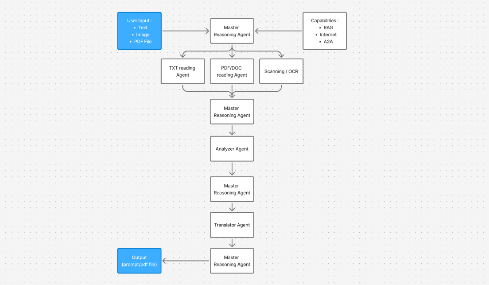

 🤖 **Lawco** - a Contract Risk Finder.

**Lawco** is an AI-powered tool that analyzes legal contracts, policies, terms and condition for you. 
It detects risky clauses and highlights potential implications.
It can simplify contracts into plain English and translate using GenAI, as well as generates a polished PDF report if required.
It works with prompts and files (TXT/PDF/DOCX).

---

## 🚀 Features

- 📄 **Multi-format support**: Analyze .pdf, .docx, or .txt files
- 🔍 **Clause risk detection** using GenAI
- ✨ **Plain English clause simplification** via GenAI summarizer
- 🧾 **Clean PDF report generation** - in progress
- 🧠 **Fallback mode**: Rule-based keyword detection if model fails
- 🖥️ **Frontend UI** for easy uploads & results
- 🔌 **AgentOS integration** for orchestrated intelligence
- ⚙️ **Dockerized microservices with docker-compose**
- 🧪 **Unit + API tests** included

---

## 🧱 Folder Structure

contract-risk-finder/

├── .github/ # GitHub workflows or issue templates

├── backend/ # Core backend logic (text extraction, model inference)

├── cli/ # Command-line interface (doc reading agent)

├── frontend/ # React frontend for file upload & result view

├── master-agent/ # GenAI orchestration logic

├── router/ # FastAPI route handlers

├── tests/ # Unit and integration tests

├── .gitignore

├── .pre-commit-config.yaml # Linting / formatting rules

├── LICENSE

├── Makefile

├── README-infrastructure.md # Infrastructure-level setup

├── README.md # You’re reading it!

├── docker-compose.yml # All-in-one multi-container setup

## Agent Workflow

## 🧠 Powered By
GenAI AgentOS (via master-agent)
FastAPI, Uvicorn
React.js
Tesseract-OCR, pdfplumber, python-docx
FPDF (PDF generation)

## 💡 Future Additions
✅ Browser extension (1-click risk highlight)
✅ Contract negotiation insights
✅ More Multi-language support (Hindi, Marathi, etc.)
✅ Clause-to-law link mapping
✅ Email alerts for risky clauses

### **Agent Framework**
- **GenAI Protocol** - Custom agent communication protocol
- **A2A SDK** (v0.2.5) - Agent-to-Agent communication
- **MCP (Model Context Protocol)** (v1.9.0) - Tool integration

## 📄 **Document Processing Stack**
### **Text Extraction Libraries**
- **PyMuPDF** (`fitz`) - PDF text extraction
- **docx2txt** - Microsoft Word document processing
- **pytesseract** - OCR text extraction from images
- **OpenCV** (v4.8.0) - Image preprocessing for OCR
- **Pillow** (v10.0.0) - Image manipulation

### **Legal Document Analysis**
- **Custom keyword-based risk detection** system
- **6 risk categories**: Liability, Payment, Dispute, Termination, Privacy, Service
- **Severity scoring** (LOW/MEDIUM/HIGH/CRITICAL)
- **Risk density calculations**

## 🌐 **Web & Search Integration**
- **Tavily API** - Primary web search for legal context
- **DuckDuckGo Search** - Fallback search engine
- **BeautifulSoup4** - Web content parsing

## 📑 License
MIT License. See LICENSE.

## ⚙️ Setup Instructions
Use [text](README-infrastructure.md) for set and add your API keys for agents - "agent_lawco", "agent_translate"

